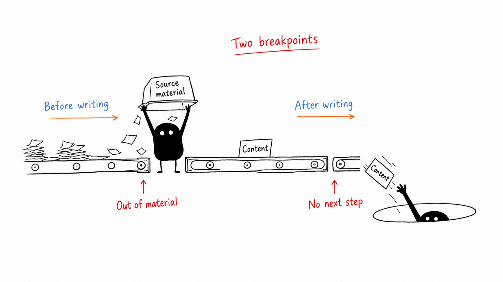
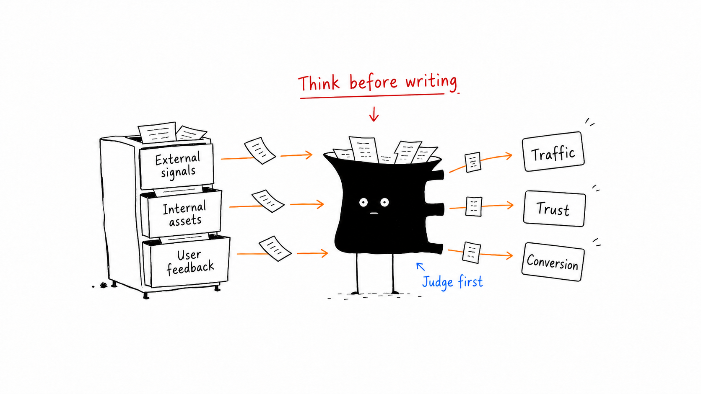
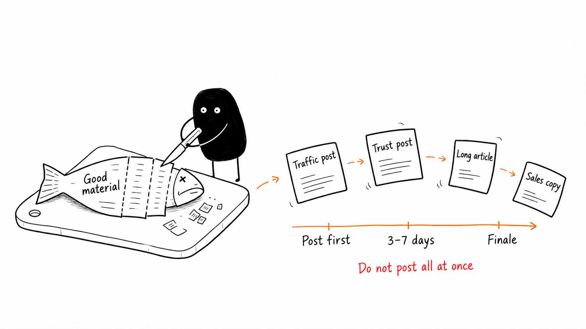
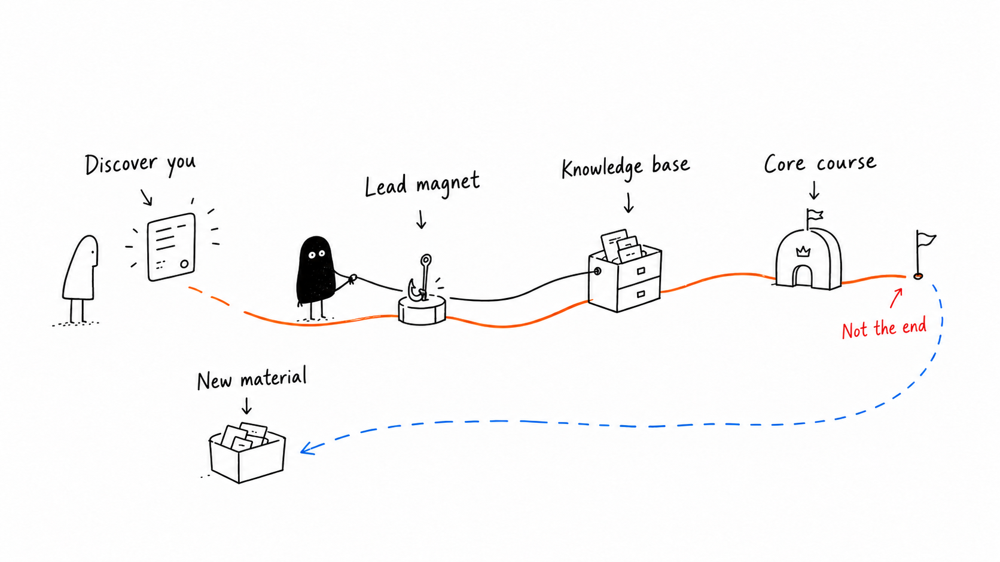
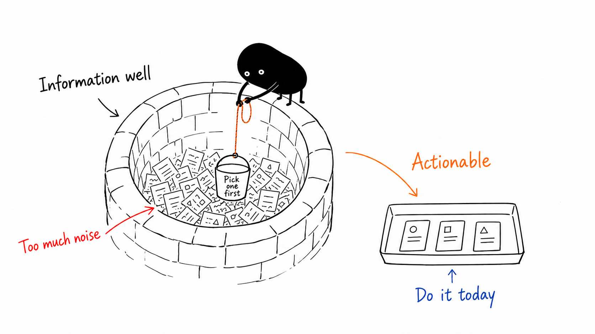
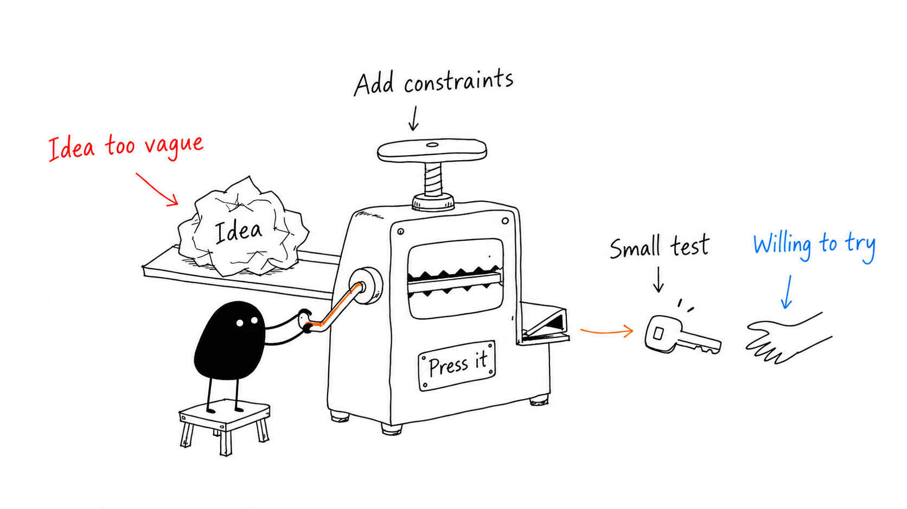
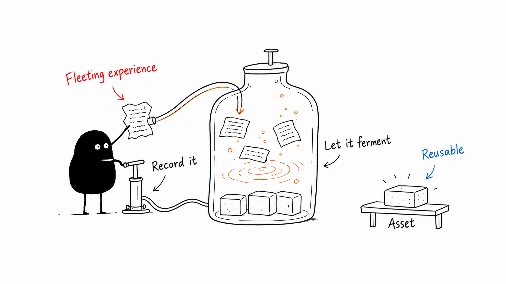
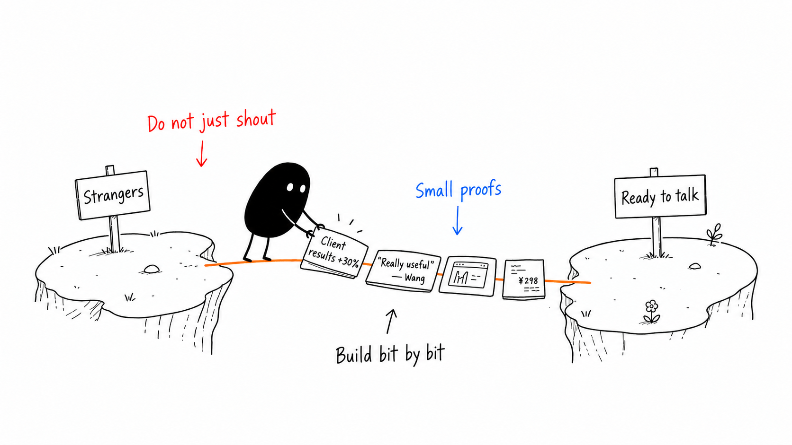

# Ian Xiaohei Illustrations

> Turn the insights, processes, states, and metaphors in English articles into clean, surreal, hand-drawn illustrations on white backgrounds.
>
> 16:9 landscape | Xiaohei character | White background and hand-drawn lines | Sparse red/orange/blue English annotations | Codex Skill

---

## What is this repository?

Ian Xiaohei Illustrations is a Codex skill that guides AI agents in generating illustrations for English articles, posts, blogs, Notion documents, and methodology content.

It identifies an article's conceptual anchors and turns a key insight, process, structure, state, or metaphor into a memorable 16:9 hand-drawn explanation. It is not a generic illustration prompt or a presentation infographic template.

The recurring character is **Xiaohei**: a small solid-black creature with white dot eyes, thin legs, and a blank expression. Xiaohei is an absurd worker earnestly operating the system, with an active role in the visual metaphor.

**Help AI draw the article's key idea in action.**

This edition uses English throughout its instructions, prompts, captions, and example image labels. The skill requires all generated text and image lettering to be English.

---

## Who is it for?

A good fit for:

- Writers who need illustrations for English articles.
- Creators working on educational content, methodologies, or AI workflows.
- People who want to turn abstract insights into concrete visual metaphors.
- Writers seeking a light, strange, recognizable visual style.
- Codex users who want a consistent visual language for content production.

Not a good fit for:

- Commercial illustration, brand campaign artwork, or polished flat illustration.
- Traditional presentation infographics, complex architecture diagrams, or formal flowcharts.
- Children's cartoons, cute mascots, or memes.
- Images filled with article text, lengthy explanations, or entire course pages.
- Work requiring fully editable vector source files.

---

## What does it produce?

Default outputs:

- 16:9 landscape article illustrations.
- A shot list of 4–8 illustrations for an article.
- Each image's theme, core idea, structure type, Xiaohei action, and suggested English labels.
- Final PNG files saved to `assets/<article-slug>-illustrations/` in the workspace.

Not included by default:

- PPTX / PDF / Keynote files.
- Editable SVG / HTML / Canvas graphics.
- Commercial posters or campaign cover artwork.
- Infographics dominated by long text passages.

---

## Visual style

The skill uses Ian's surreal Xiaohei article illustration style:

- Pure white backgrounds, without paper texture, beige, shadows, or gradients.
- Thin black hand-drawn lines with a slight wobble.
- Generous whitespace; the subject occupies roughly 40%–60% of the canvas.
- Sparse red, orange, and blue handwritten English annotations.
- One core action, structure, state, or metaphor per image.
- Xiaohei performs the central action.
- Surreal, inventive, and clean, without childishness or forced cuteness.

---

## Examples

### Two breakpoints



### Sort by purpose



### One fish, many uses



### Path to the next step



### Information well



### Idea press



### Content fermentation



### Trust bridge



These images calibrate the style. Invent metaphors from the current article instead of copying their objects and compositions.

---

## Installation

Clone the repository:

```bash
git clone https://github.com/glevco/ian-xiaohei-illustrations-en.git
cd ian-xiaohei-illustrations-en
```

Copy the skill into the Codex skills directory:

```bash
mkdir -p "${CODEX_HOME:-$HOME/.codex}/skills"
cp -R ./ian-xiaohei-illustrations "${CODEX_HOME:-$HOME/.codex}/skills/"
```

After installation, invoke it in Codex:

```text
Use $ian-xiaohei-illustrations to design and generate 5 surreal Xiaohei illustrations for this English article.
```

---

## Usage

### Plan illustrations only

```text
Use $ian-xiaohei-illustrations to plan illustrations without generating images yet.
Analyze where the article below would benefit from illustrations and provide a shot list of about 5 images.
For each image, specify its placement, theme, core idea, structure type, Xiaohei's action, and suggested English labels.

<paste article here>
```

### Generate article illustrations

```text
Use $ian-xiaohei-illustrations to generate 4 surreal Xiaohei illustrations for the article below.
Requirements: 16:9 landscape, pure white background, black hand-drawn line art, and sparse red/orange/blue handwritten English annotations.

<paste article here>
```

### Illustrate a single concept

```text
Use $ian-xiaohei-illustrations to generate an article illustration for "Trust is built one piece of evidence at a time."
Keep the image surreal but clean. Xiaohei must perform the central action.
```

### Remove a title or incorrect text

```text
Use $ian-xiaohei-illustrations to edit this image. Remove the "Workflow" title in the top-left corner and keep everything else unchanged.
```

See [examples/prompts.md](examples/prompts.md) for more prompts.

---

## Workflow

1. Read the article, Markdown, Notion content, screenshot, or supplied topic.
2. Identify key ideas, shifts in understanding, processes, and passages suited to visualization.
3. Create a shot list with one conceptual anchor per image.
4. Choose a structure: workflow, part of a system, before/after comparison, character states, conceptual metaphor, method layers, route map, or short comic sequence.
5. Invent a surreal but coherent physical metaphor using simple objects.
6. Give Xiaohei the central action.
7. Generate each image with a separate image-model call.
8. Review the white background, whitespace, Xiaohei's action, English labels, originality, and freedom from presentation styling.
9. Save final PNGs and report their purposes and paths.

---

## Repository structure

```text
.
├── README.md
├── LICENSE
├── NOTICE.md
├── assets/
│   └── ian-wechat-qr.jpg
├── examples/
│   ├── images/
│   │   ├── 01-two-breakpoints-en.png
│   │   ├── 02-sort-by-purpose-en.png
│   │   └── ...
│   └── prompts.md
└── ian-xiaohei-illustrations/
    ├── SKILL.md
    ├── agents/
    │   └── openai.yaml
    ├── assets/
    │   └── examples/
    └── references/
        ├── style-dna.md
        ├── xiaohei-ip.md
        ├── composition-patterns.md
        ├── prompt-template.md
        └── qa-checklist.md
```

Install only the `ian-xiaohei-illustrations/` subdirectory into Codex. The root README, LICENSE, NOTICE, and examples support sharing the repository on GitHub.

---

## Practical notes

- Short English labels render more reliably; aim for 1–4 words each.
- Each image should communicate one core structure.
- Xiaohei must perform the central action. If removing the character leaves the metaphor fully intact, the role is too decorative.
- Examples calibrate line density, whitespace, restrained color, and Xiaohei's participation. Do not copy their compositions.
- Review generated images for misspellings, invented labels, style drift, unwanted titles, and non-English text.
- If text errors are extensive, reduce the number of labels and regenerate.

---

## Related projects

- [Ian Handdrawn PPT](https://github.com/helloianneo/ian-handdrawn-ppt) — A skill for generating hand-drawn technical presentation images in Chinese.
- [Awesome Claude Code Skills](https://github.com/helloianneo/awesome-claude-code-skills) — A curated collection of Claude Code skills, agents, and plugins.
- [Obsidian + Claude AI Second Brain](https://github.com/helloianneo/obsidian-ai-second-brain) — A guide to building a personal knowledge base with Obsidian and Claude AI.

---

## About the author

**Ian** — Product designer / Solo entrepreneur / AI builder

Building a one-person company with an AI team.

- GitHub: [helloianneo](https://github.com/helloianneo)
- X/Twitter: [@ianneo_ai](https://x.com/ianneo_ai)
- Website: [www.ianneo.xyz](https://www.ianneo.xyz)
- WeChat: `ianneoxyz`
- Email: hello.neoc@gmail.com

---

## Keep exploring

This Xiaohei illustration skill is one small tool in the personal production system I am building with AI.

If you use AI for content, knowledge bases, workflows, or turning ideas into products, explore my website: [www.ianneo.xyz](https://www.ianneo.xyz).

To follow along, find me on [X/Twitter](https://x.com/ianneo_ai).

To learn about Indie Builders Club, add `ianneoxyz` on WeChat and include "OPC" in your request.

<p>
  
</p>

You can also search WeChat for `ianneoxyz`.

---

## License

MIT License. See [LICENSE](LICENSE).
